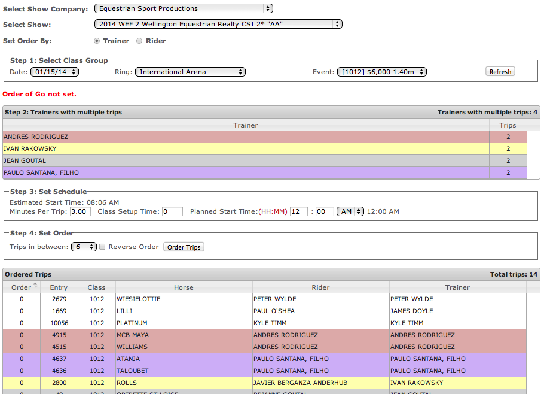
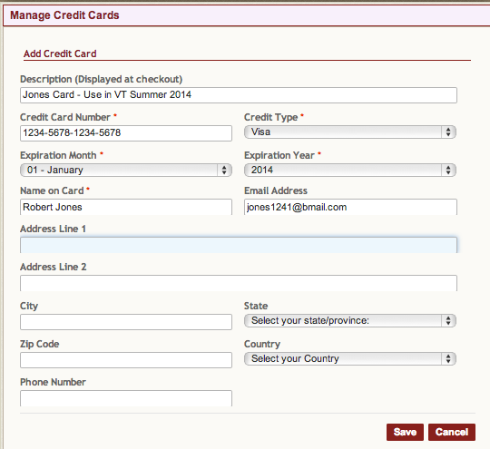

# 📓 Release Notes - November 2013

We've got great new features to announce from ShowGrounds! Read on for details and please contact us if you'd like more info or help.

## New Features

### Web-based Order of Go tool

The web-based order of go tool allows your staff to set orders no matter where they are through a convenient web interface.

<figure><figcaption></figcaption></figure>

To learn more about using this tool [go here](http://showgroundsonline.com/new/how-to-setting-orders-of-go-via-web-browser/).

### Credit card storage available to users

Now riders, trainers, and owners can input their credit card info and have it stored on ShowGroundsLive.com for later use by them or the show office. As you know, this is super secure and a great time-saver.

Users can also add a personalized description as a reminder for future payments. See example below earmarked for the Smiths:

<figure><figcaption></figcaption></figure>

### Sponsor names added to website

We now display the names of sponsors underneath the class name throughout the website. Check it out!

### New Print Options Online

.png>) We've added some handy buttons so you or the user can print out info easily from the site. Look for the icons on the top right-hand side of the screen. Click the printer and get a nice, clean printout of the page you're on!

### Small changes to payment batches

<figure><figcaption></figcaption></figure>

We’ve made a number of small improvements in the Payment Batches system.

1. Enhanced Quickbooks export - Now allows you to select if checks should be marked as “To Print”.  Can export both posted and non-posted payments.\
   Also able to provide over-ride description for check memos.
2. It is now possible to edit check numbers both before and after checks are posted.
3. We also added a column for check numbers with title references when viewing payments in RTO account screen.

### RTO balance summary report

This report can now be exported to Excel with ease.

### Membership overrides

When a membership record is over-ridden from the entry itself it now  results in a history record being created for that entry. The text will correspond to the RTO.

## Minor Changes & Bug Fixes

Below are a list of small changes made in the system.

1. Fixed a small bug in the "My Schedule" functionality on ShowGroundsLive.com
2. Fixed a bug on Spreedly to allow payments to be refunded or voided
3. Fixed a bug with online class signups
4. Fixed a bug on the Order Supplie screen
5. Fixed a bug with the scheduler for adding classes for future shows
6. Fixed a bug with the new Order of Go tool
