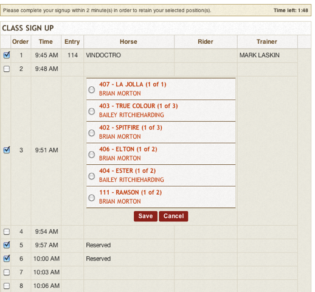

# 📓 Release Notes - September 2013

Here are the latest updates and news from our diligent programmers and team at ShowGrounds! Please don't hesitate to contact us if you have any questions about the following. You should now be operating on v.4.01.51.

## New Features

### Setting Order of Go

We have created a tool to set the Order of Go randomly (but with rules). Check it out!

Go to: Classes > the wheel > Set Order of Go:

1. Select the Date/Ring/Group_._
2. Select the Point Horse for Riders with multiple entries. If there are no riders with multiple entries, then skip this step.
3. Select the trips in between riders and click _Order Trips._
4. Click Save to apply the Order.

<figure><figcaption></figcaption></figure>

This tool sets a random order based on the following rules about riders:

* Riders with multiple entries are color coded, i.e., each rider is assigned a different color.
* If the available trips in-between are less than 8, then the tool will fit in as many as possible with even distribution.
* The Order will be set with riders having more multiple trips scheduled first. That way it will be easier to distribute in-between trips. The riders with the same number of trips will be picked randomly. Ideally, re-ordering trips should yield a different Order of Go each time.

**Please note:** You can drag/drop to change the order. For classes that have web signups, there is a confirmation dialogue set up before an admin user can randomize a pre-set Order. We are also working to make an additional feature that will allow the tool to randomize the Order of Go by trainer groups.

## New Reports:

### **Order of Go by class group report**

This report gives our same functionality as before but now is based on Class Groups. Previous versions of this report did not a allow for orders for grouped classes.

### Payment type and show report

We have developed a new report that provides a summary of payments based on payment distributions. This report summarizes payments by the Payment type and the show they were applied to. It's ideal for keeping your accounting software in line with ShowGrounds with regard to open balances on each show.

<figure><figcaption></figcaption></figure>

## Spreedly conversion

Last month's conversion to [Spreedly.com](http://spreedly.com) was successful. We moved stored cards from 4D to the Spreedly vault and began recording new transactions. We continue to integrate the new system for each of our valued show management companies. We are currently addressing adjustments to reporting.

### Trainer splits

We made some small changes to trainer splits:

1. Moved entry number next to "exclude" checkbox for easier reference.
2. Auto-split full balance immediately after selecting trainer, to eliminate steps. Can still change amounts as needed.

### RTO Schedule

We created a pull-down box so users can select the date with more ease when printing out the Rider, Owner, Trainer schedule.

<figure><figcaption></figcaption></figure>

### USEF updates

On September 18, USEF updated its website, causing issues connecting with their web services for membership verifications. It has now been resolved.

## Online class signups

.png>)We have fine-tuned this process so less steps are involved when signing up for trips. This is especially helpful, for instance, when a user needs to sign up several riders. The lists now appear as a scrolling list for easier access.

<figure><figcaption></figcaption></figure>

## Minor Changes & Bug Fixes

Below are a list of small changes made in the system.

1. Fixed a bug to display a more detailed error message when a transaction is declined.
2. Fixed runtime error in Summary and Detail Report.
3. For class signups in Order of Go, we fixed a sorting issue.
4. Updated readerboard and ring page to reflect correct timezone.
5. Made a tiny but important sorting change to the Trainer Add/Drop sheet so it sorts by entry number automatically.
6. Fixed a bug that occurred when adding time or jump faults cleared the data on the scoreboard but set the faults.
7. Addressed a bug that affected the display of info on the Live Class page.
8. For credit cards used previously but not stored, we corrected a bug that caused an error message saying the credit card was redacted.
9. For supply order e-mails, we reworked the message so it reflects the details of the entry and show the order relates to.
10. Optimized the way champions and reserve champions are listed in divisions so that _multiple_ champions/reserve champions are displayed.
11. Made a change in the USEF export to include time faults and jump faults.
