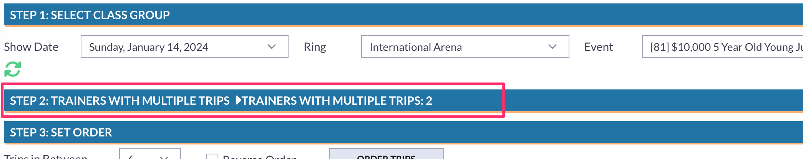

# 📔 Release Notes- January 2024

## Cloud Updates

We have released several Cloud-based tools to some companies. We will continue to gradually release these tools to more companies in the coming weeks. You can access documentation for these new cloud-based tools by using the following link: [Cloud Tools](https://gitbook.showgroundsonline.com/showgrounds-cloud-documentation/modules/tools)

**Set Order Updates**

As shown below, once the Order of Go is set or updated, the date and time of the change along with the user who made the change will appear in red.

<figure><figcaption></figcaption></figure>

### Schooling Round Tool

## Set Up Schooling Rounds

[**Made by Spencer Spevak with Scribe**](https://scribehow.com/shared/Set\_Up\_Schooling\_Rounds\_\_\_BdTGQEeToe19D7jFxMxjA)

Alert: A Schooling Rounds Tool has been added to the cloud interface.

1\. First, navigate to the Cloud Admin Site. Select "General" under System Preferences.

2\. The dropdown next to Schooling Round Fee will present a list of all master fees. Select the correct master fee for schooling rounds.

Tip: Should you have questions regarding master fees, please follow the link below:

[https://app.gitbook.com/o/xn4xuKcWYeKdMrduu1YG/s/lZXi8Pay2ZqP2um7fNsc/modules/master-fees/master-fees](https://app.gitbook.com/o/xn4xuKcWYeKdMrduu1YG/s/lZXi8Pay2ZqP2um7fNsc/modules/master-fees/master-fees)

3\. Click the Save button to save changes and update schooling round fees.

4\. Next, navigate to the cloud. Under Tools, select Schooling Rounds.

5\. Key in entry number and click add or hit enter. You may have multiple entries going at the same time.

6\. When a particular horse has completed their schooling round, single click over top of "finished".

7\. Should you wish to add an additional schooling trip, single click on the horse's name. If the time under Lapsed is under two minutes, a warning prompt will appear before adding the trip.

Tip: Schooling Round fees will be added to the entry's balance automatically.

[**Made with Scribe**](https://scribehow.com/shared/Set\_Up\_Schooling\_Rounds\_\_\_BdTGQEeToe19D7jFxMxjA)

### Set Planned Time Tool

With the new cloud-based announcer tools that we released, it was realized that an ability that announcers had in the old version had not been replicated across to the cloud version. The Set Planned Time tool was added to account for that difference.&#x20;

The Set Planned Time tool is available for users in the Ingate and Announcer group.&#x20;

<figure><figcaption></figcaption></figure>

This tool allows the user to edit the Minutes Per Trip, Class Setup Time, and Planned Start Time for classes/class groups.&#x20;

### Order of Go

There have been a few changes made to the Order of Go tool to make it more user friendly.&#x20;

1.  Users can expand or collapse Step 2 when setting an order of go. This is done by clicking the Step 2 Header.

    <figure><figcaption></figcaption></figure>

2. When the user is manually setting the order, they can type entry numbers in the "Provide Entry No. to Set Order" box and either hit the enter button on the keyboard or press the Order Trip option. The entry will then be added to the set order, the box will clear, and the user can continue to add entries.&#x20;

<figure><figcaption></figcaption></figure>

##

### Simple Scheduler

We have added an "Auto Scroll" option to the scheduler. With this enabled, the classes/class groups will all show on the same part of the screen instead of the user having to scroll through the class group list. Users can enable or disable depending on their preference.&#x20;

<figure><figcaption></figcaption></figure>

## Changing the Secured Card for an Entry

We have made a few additions to the process to change a card on the entry.&#x20;

1. Users can now also choose the secured card for manual entries done in the office.&#x20;
2. Office users can choose to change the secured card for entries entered in multiple shows in a series. The system will show the option to use the card across multiple entries.&#x20;

<figure><figcaption></figcaption></figure>

Users can choose to change the card across multiple entries by choosing OK. If the user only wants to change the card for one entry, hitting cancel would only apply the change to the current entry.&#x20;

3. The system now runs a check to ensure that the card will not expire before the end of a show or series. If the card does expire before the last date of the show, the system will show an error message to alert the user that the card cannot be used to secure the entry.&#x20;

<figure><figcaption></figcaption></figure>

4. In the entry record, the secured card information now also shows the expiration date for that card.

<figure><figcaption></figcaption></figure>

###

#### Small Changes and Bug Fixes

1. There was an issue with horses aging incorrectly as of 1/1/2024. Horses were appearing as one year younger than their actual age. This has been corrected for all current and upcoming shows.
2. We have added a Class Officials report to the Classes module. Running this report will show the officials for each class. This report is broken down by each date and ring and will show all classes scheduled in that ring with the corresponding officials.&#x20;
3. There was an issue in the app where it would not show results. This has been fixed and the app is now showing results correctly.&#x20;
4. There was an issue where a rider's country flag was displaying incorrectly on the app for live classes and results. This has been fixed and the app is showing flags and countries correctly.
5. It was noted that certain rider eliminations were not properly displaying on the Live Class page online. This has been updated and fixed to include all elimination codes recently added to the In Gate Tool.
6. In the case of a refund, the original credit card charge AND refund will now appear on an invoice.

