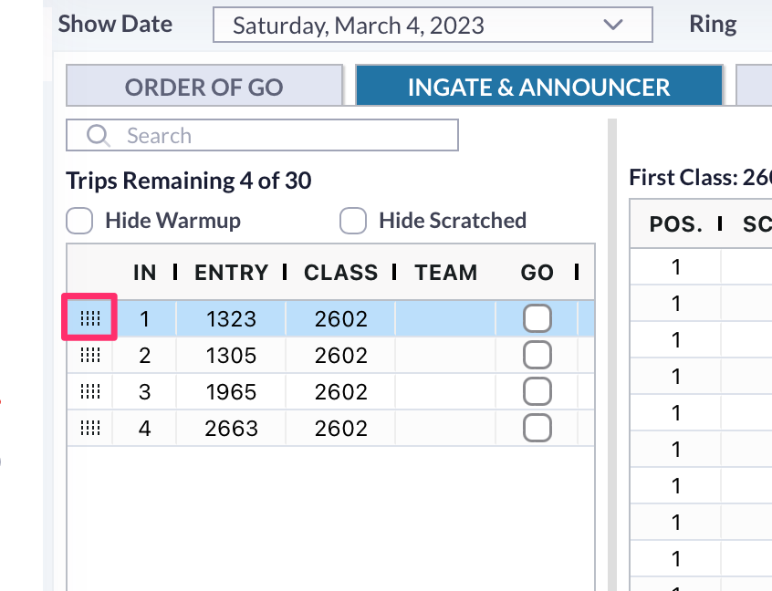

# 📔 Release Notes- July 2024

### Announcer Tool Changes

There were reports that when using the announcer tool on an iPad, if the user tried scrolling through the trips left to go, it would change the order on the trips instead of scrolling through.&#x20;

We have added a button to the list of trips left to go. When the user wants to move a trip, they have to press that button in order to do so.&#x20;

<figure><figcaption></figcaption></figure>

When the user holds this button on the trip, that will allow them to move the trip.&#x20;

When a user wants to just scroll through the trips, touching anywhere else in the list of trips will allow the user to scroll freely without changing the order.&#x20;

#### Small Changes/ Bug Fixes

1. There was an issue where trips being marked gone and then marking them back as trips to go was changing the start times on classes. This was making the start times for classes show differently than what was on the schedule. This issue has been fixed.&#x20;
2. There was an issue within the announcer's tool that certain buttons were hungup or trips couldn't be moved over. This issue has been fixed.&#x20;
3. There was an issue when cancelling classes in the scheduler. The system would report an error saying that the class couldn't be cancelled due to placings and results. None of the trips had even been marked as gone in the class. This issue has been fixed.&#x20;
