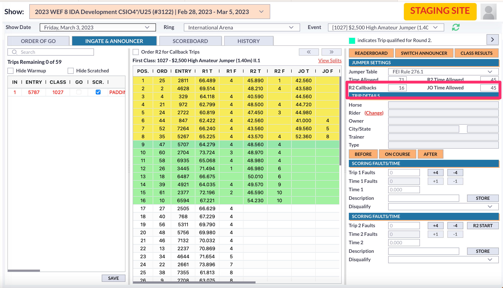
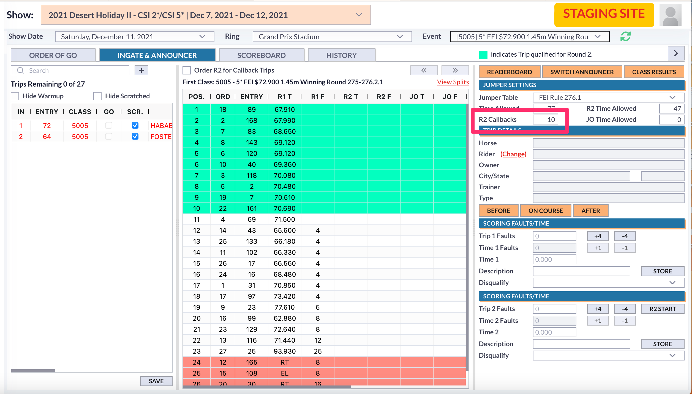

# 📔 Release Notes- March 2024

## CIT/MIT Transactions

Since we have seen issues with one type of payment gateway disallowing MIT payments without a CIT payment on file, we had added a checkbox to the payment screen to distinguish a payment made in office as a CIT payment.&#x20;

<figure><figcaption></figcaption></figure>

\*\*It is important to remember that when using this option to distinguish payment, it is the show office's responsibility to ensure that the customer does have knowledge that the payment is going to be run and is essentially requesting that the show office run the payment on their behalf.&#x20;

When running a payment on an entry, if there is not a previous CIT transaction on file for that company, a message will show and prompt the user to distinguish the payment as a CIT transaction.

<figure><figcaption></figcaption></figure>

## Cards Disappearing from Entries

There was an issue with the secured card on an entry not being available in the list of cards to close out an entry.&#x20;

We found that this was occurring because the card used to secure the entry was found in the account that created the entry. If the account was unlinked from the entry, the card was also being removed because it was not associated to any of the RTO's on the entry.

We have added a fix to this process to keep the card that was used to secure the entry even if it is not associated to any of the RTO's on the entry.&#x20;

## Horse Height Requirements

We have made changes to the system to incorporate the USEF rule of the difference in horse height for the Junior Hunter classes.

This rule now classifies that Small Junior Hunters are 16.1 hands and smaller, while Large Junior Hunters are taller than 16.1 hands. This rule has not changed for other classes.&#x20;

In the class detail, users are able to set a Horse Type (S/M/L pony, S/L horse) OR set a height range for Horse Height. **Please note that ONLY ONE of these preferences can be set per class.**

<figure><figcaption>
As seen above, users may enter the range in hands. The height range may also be entered in meters or centimeters.
</figcaption></figure>

As with existing requirements, the user may select “warn” to warn a user that the horse does not fit the requirements to be in the class or select “disallow” which will produce an error message and will not allow the entry to be added if it is outside of the requirements.

<figure><figcaption>
Example of the message when the warn option is set. 
</figcaption></figure>

<figure><figcaption>
Example of the message when the disallow option is set. 
</figcaption></figure>

### Entry Verification

To verify entries by the horse height is run in the verification process. The choice for Horse Height is found in the Horse Requirements section of the Verification window.&#x20;

<figure><figcaption></figcaption></figure>

Select Horse Height as the requirement and click continue. Green/verified entries are those that fit the requirements OR are not in classes with the requirements. Red/unverified entries are those that do NOT fit the specified class requirement.

<figure><figcaption></figcaption></figure>

####

## FEI Jumper Table 276.1

We have added the following changes to incorporate the jumper table 276.1

Users will now find the FEI Jumper Table 276.1 selection in the Jumper Table dropdown.

<figure><figcaption></figcaption></figure>

When using this jumper table, the user needs to set the Time Allowed for the third round and the number of R2 callbacks. When choosing this jumper table, if the user does not set the number of R2 callbacks, it will automatically be set to 16. However, the user can set this to a different number of callbacks if needed.&#x20;

<figure><figcaption></figcaption></figure>

When using this table, it is assumed that half of the 16 round 2 trips will compete in round 3. These trips are shown highlighted in yellow.

<figure><figcaption></figcaption></figure>

Using the Order R2 for Callback trips checkbox will order the 16 trips in order from worst to best in ranking since the additional rounds for these classes have the competitors jump in order of their ranking from worst to last.&#x20;

<figure><figcaption></figcaption></figure>

####

## FEI Jumper Table 276.2

We have implemented changes in the ingate/announcer tool to accomodate the FEI Rule 276.2

Users can set the number of R2 callbacks in the Jumper Settings section. The amount of trips that will come back for the 2nd round will show in green in the list.&#x20;

<figure><figcaption></figcaption></figure>

Trips under this jumper rule that compete in the second round will go in order from worst to best. We have added a checkbox, Order R2 for Callback Trips, that will allow the user to see the trips ordered from worst to best on their performance in the first round.

<figure><figcaption>
In this screenshot, the checkbox is not enabled. This shows the list of trips in order from best to worst. 
</figcaption></figure>

<figure><figcaption>
In this example, the checkbox is enabled and those same trips show the reverse order for the 2nd round. 
</figcaption></figure>

####

## USEF Table IV and USEF Table IV 2b

We have added changes to allow for these two tables to be selected.

Ingate users need to set the Optimum Time for Round 1 and jump off round based on the specific table that is being used.

When using table IV, the Optimum Time must be set for Round 1.

When using table IV 2b, the Optimum Time must be set for Round 1 and the Jump Off.

The Optimum Time is set by default to be 4 seconds less than the time allowed, but users can override this value.&#x20;

<figure><figcaption></figcaption></figure>

#### Small Changes Bug Fixes

1. There was an issue with the USEF membership shields in the entry not populating information. This has been resolved.&#x20;
2. There was a small bug when setting up teams, the system was pulling rider's country from their address instead of the country listed under the "Riding For" status. This has been fixed.&#x20;
3. An issue appeared regarding result submissions to FEI in team events. This has been addressed and fixed. FEI team event results should now submit to FEI as expected.
4. There was an issue with the CIT statuses of online transactions being saved for cards. This was prompting users in the office to run payments as CIT when there should have already been a CIT payment on file. This has been fixed.&#x20;
5. Additional dropdown options of "EC" and "Active" have been added to the Manual Override Menu.

<figure><figcaption></figcaption></figure>

6. There was an issue with info classes in the schedule and their start time changing times on the schedule. This has been fixed.&#x20;
