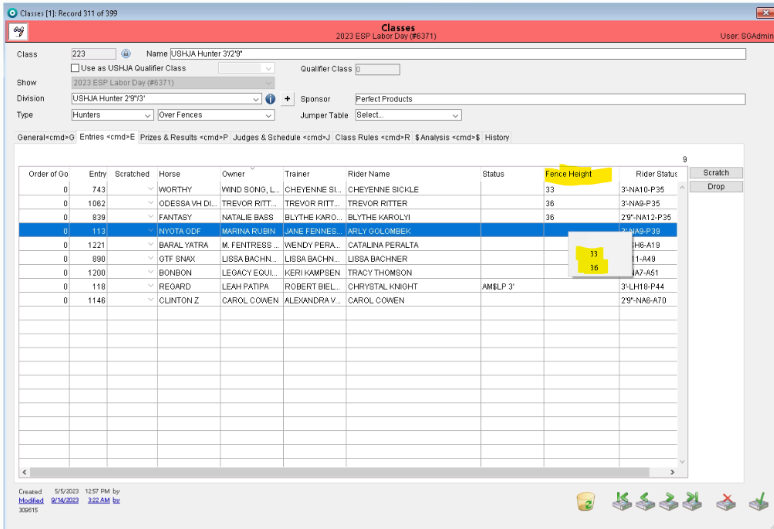

# 📔 Release Notes - May 2024

##

## Officials Acting as Both Judge and Course Designer at Same Show

Users are now able to add an individual as both a Judge and a Course designer at the same show.

The user should proceed as normal adding an individual in the shows module. Add them as a Judge, then add as a Course Designer (or other way around, order does not matter). You will then see the individual shown twice under officials.

<figure><figcaption></figcaption></figure>

## Classes with Multiple Jump Heights Offered

\*Please note this is ONLY for classes that offer multiple jump heights. This is NOT applicable to combined classes. For combined classes, please use the combine feature.

It was reported that results for classes offering multiple jump heights were not per USEF specifications. The program now supports these classes using the features described below and will produce satisfactory results for USEF.

As pictured below, the team has added a “heights” field to be used for classes with multiple jump height options:

<figure><figcaption></figcaption></figure>

In the original “fence height” field, you may enter one of the jump heights offered for the class. This will be the default if no specific height is selected for the entry. In order to indicate that the class is to be run at multiple heights, the user should enter the heights in the “heights” field in INCHES ONLY separated by commas in the new field as seen above. For example, a class that is to run at 2’9 and 3’ MUST be entered in the new field as follows: “33, 36”.

&#x20;“2’9, 3’” would NOT be a valid entry. This requirement for inches only is to streamline data and ensure consistency.

The user would then navigate to the class in question. In the entries tab, upon clicking on the fence height field, the user would see a drop down for each entry. To continue with the example above, the dropdown would have the options of “33, 36” to indicate which height that entry will jump.

<figure><figcaption></figcaption></figure>

With these new methods, results will be displayed with proper information per USEF’s request and requirements.

## Returned Payment- Chargeback

At this time, this tool is only released to WPE. This allows the office users to reverse a payment without refunding the payment amount. This should be used in cases where a payment is disputed.

If a payment is disputed by the card-holder and the office needs to exhibit this in the records, the chargeback tool should be used to indicate this for the payment.&#x20;

This tool is now found in the payment record.&#x20;

Opening a payment record, you will still need to use the refund transaction button to access the chargeback.&#x20;

<figure><figcaption></figcaption></figure>

Once you open the refund transaction page, you will be able to use the chargeback checkbox.&#x20;

<figure><figcaption></figcaption></figure>

If the chargeback box is checked, you must provide a reason for the chargeback in the reason box. Once these items are completed, if the user chooses to apply, the system will ask the user for confirmation that the payment should be refunded as a chargeback.&#x20;

<figure><figcaption></figcaption></figure>

Once the user chooses OK, the payment is reversed, but not refunded. This action will show in the payment record. When a payment has been signified as being a chargeback, the chargeback checkbox in the upper right corner of the payment record will be checked off.&#x20;

<figure><figcaption></figcaption></figure>

In the entry account, the chargeback will be listed in the payment detail dialogue. Opening the specific payment detail will provide all the details of the reversed transaction.

<figure><figcaption></figcaption></figure>

The chargeback reversal is also listed in the entry history.&#x20;

<figure><figcaption></figcaption></figure>

#### Small Changes/Bug Fixes

1. Changes to the planned start time in the schedule will now show in the schedule history.&#x20;
2. We have added the ability to text support. For any support questions, you can text us at the number: 413-625-3177 and reach a support specialist.&#x20;
