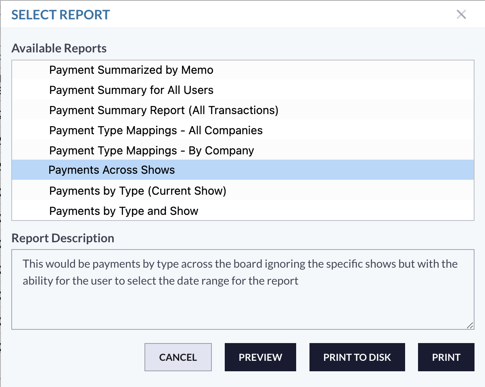

# 📔 Release Notes - October 2024

## Cloud Updates

### .CSV Export For Reports

The development team has added an option to “print to disk” to print reports to a .csv file as seen below.

<figure><figcaption></figcaption></figure>

**\*\*Please note, this is not yet enabled for all reports due to upgraded design requirements. The development team will be working through reports and enabling as they go.\*\***

### Class Number/Division Code Check

We have implemented a check in the system for class numbers and division codes. If a user attempts to add a class that has the same number as a division code or vice versa, the system will show an error message explaining that the numbers are the same and one must be changed.&#x20;

<figure><figcaption></figcaption></figure>

### Edit/Delete Notes

We have added the ability for users to edit or delete notes that are made in an entry record.&#x20;

<figure><figcaption></figcaption></figure>

This will allow users to delete notes when they are no longer relevant to the entry or make any edits to a note instead of having multiple notes in the entry record.&#x20;

### Payments Across Shows Report

We have added a report to the Payments module to show payments made within certain date ranges instead of specifically by show.&#x20;

<figure><figcaption></figcaption></figure>

When running the report, users can select a date range to pull a list of payments made during that time frame.&#x20;

<figure><figcaption></figcaption></figure>

Once the user has selected the date range, the report will be ran and show the payments made within that date range. These payments will be separated by each type of payment.&#x20;

<figure><figcaption></figcaption></figure>

### Payment Summary for All Users Report

This new report will show the breakdown for payments that each ShowGrounds user has ran in the system.&#x20;

<figure><figcaption></figcaption></figure>

This report, like the Payments Across Shows report, can be pulled by a specific date range.&#x20;

<figure><figcaption></figcaption></figure>

The report will then show the breakdown of payments made by each user in the office. The report will show each payment and the total amount of all the payments that the user ran.&#x20;

<figure><figcaption></figcaption></figure>

<figure><figcaption></figcaption></figure>

<figure><figcaption></figcaption></figure>

Users will also see the breakdown of each type of payment that was ran by a specific user.&#x20;

## Small Changes/Bug Fixes

### Digital Signature Country Flag Fix

There was an issue on the exhibitor side with the wrong country flag being shown for the digital signature portion. This has been fixed and the correct flag will now show when the phone number is input.&#x20;

### Double Placings in Placing Template

There was an issue in cloud where placing templates were duplicating placings. So a placing template with 8 places would have two first places, two second places, etc. and would actually show 16 different placings instead of the actual 1-8. This has been fixed.&#x20;
