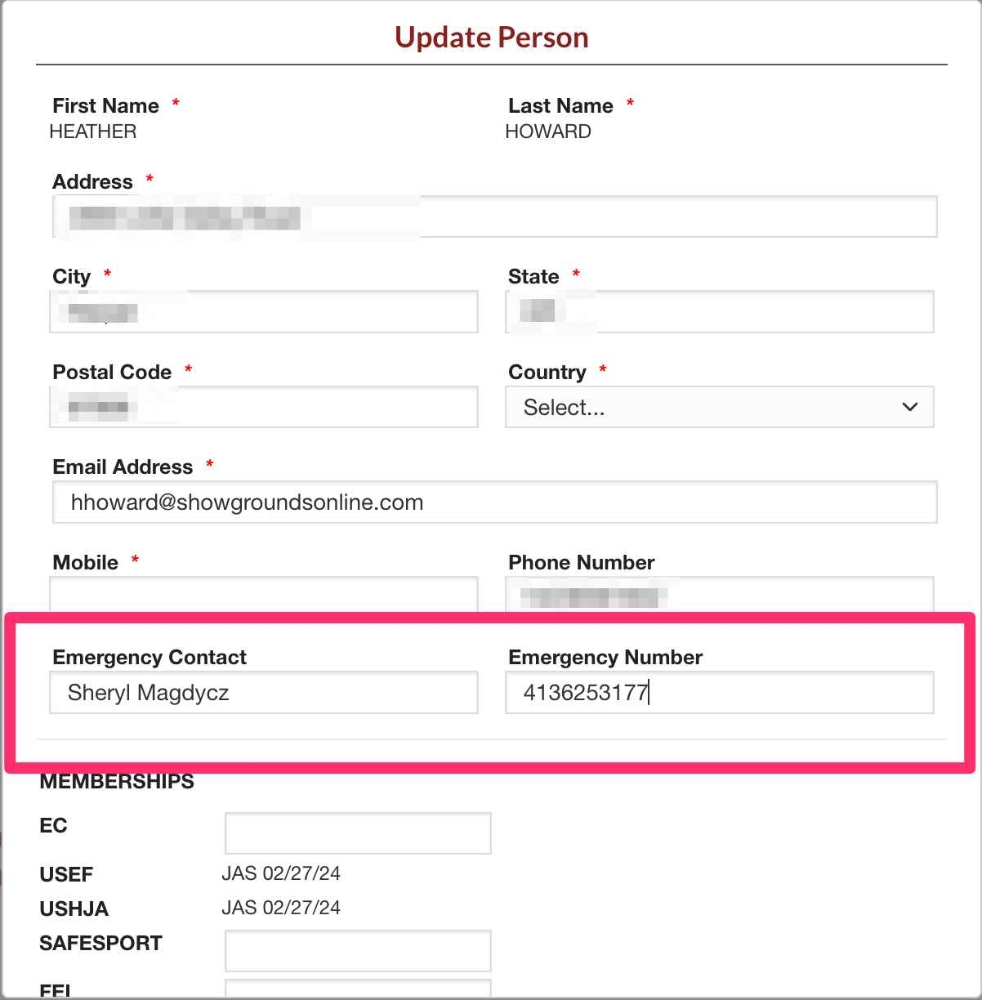
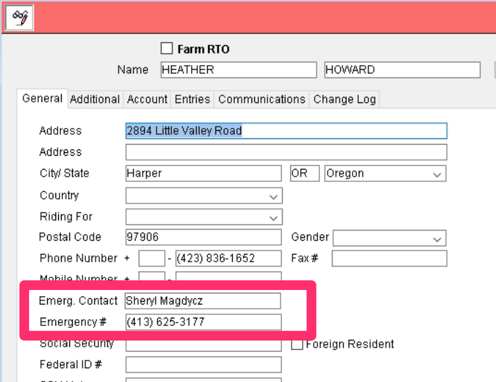
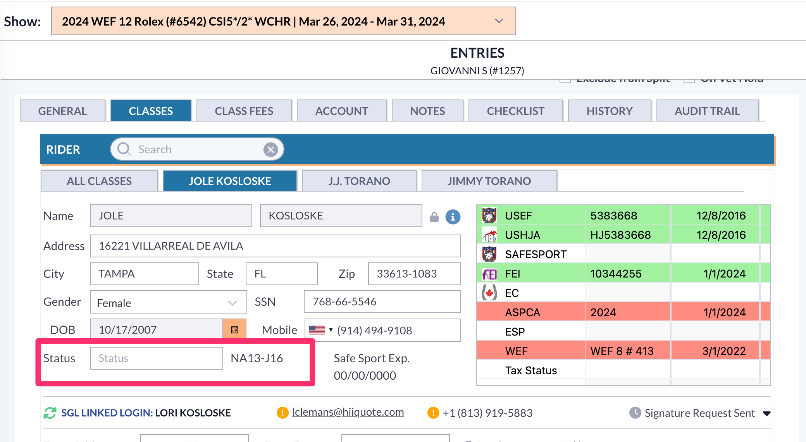

# 📔 Release Notes- September 2024

## Emergency Contact Input on Online Entry

We have implemented a way for a person to designate the emergency contact for a rider in the online entry process.&#x20;

Now when exhibitors are creating an online entry, in the rider information, there will be an option to update that rider's information.&#x20;

<figure><figcaption></figcaption></figure>

If the person inputting the entry clicks that, there are now input boxes for the rider's emergency contact name and the emergency contact number.&#x20;

<figure><figcaption></figcaption></figure>

### Emergency Contact Information in Office

To find a person's emergency contact, office staff can access the person's RTO account. The information provided in the entry process will be input in the person's RTO record.&#x20;

The contact information is found in the General tab of an RTO record.&#x20;

<figure><figcaption></figcaption></figure>

This allows office users to quickly find the emergency contact for a person if needed.&#x20;

The emergency contact can be updated by the office staff if a paper entry is accepted by the office or if a person changes their emergency contact.&#x20;

## Small Changes/Bug Fixes

## Cloud Updates

There are a few companies that have switched over to the production version of cloud already. Updates made to the cloud system will be available in this section of release notes.&#x20;

### PMR/RP Error

Users were receiving an error for entries stating that the Responsible Party and the Prize Money Recipient needed to be set for the entry. This error was coming through even though these were already set on the entry.&#x20;

This was happening when a horse was added from the organization lookup and the related roles of owner or trainer were populated into the entry from the lookup of the horse. This has been fixed.&#x20;

### Invoices Showing Old Information

There was an issue where changes were made on an entry. The office would print an invoice for an entry, and the class fees for classes that had been removed were still showing for the entry. This has been fixed.&#x20;

### Import Show Copied Over Show Dates

Users were reporting that using the import show option without having the copy schedule option checked still brought in the dates that the original classes were scheduled for.&#x20;

This has been fixed. Now when a user imports a show, the class dates will not copy over if the schedule option is left unchecked.&#x20;

### Division Price in List View

The option for the division price to be a column in the list view was missing on cloud. &#x20;

This has been fixed and the division price is now one of the available columns

<figure><figcaption></figcaption></figure>

### USEF Farm Lookup

In cloud, user's can now look up farm's through the local database or USEF when adding entries.&#x20;

To look up a farm, the first and last name boxes need to be empty. This will allow the farm name box to be editable.&#x20;

<figure><figcaption></figcaption></figure>

The user can then input the farm name to search through the local database or use the USEF Name Lookup button.&#x20;

### Combined Divisions Pricing on Entries

There was an issue when divisions were combined, the prices for those classes/divisions would not show up on the entry. This has been fixed.&#x20;

### Recalculate Fee Quantity

The Recalculate Quantity Sold option has been added into the Quick Action menu in the list view of fees. This allows the user to run another calculation on the quantity of items sold in case there is a discrepancy.&#x20;

&#x20;

<figure><figcaption></figcaption></figure>

### Applying Payment to Multiple Entries

There was an issue when applying a payment to multiple entries. The first entry in the list would show as paid off, but any other entries in the list showed no payment made towards the entry. In the show company's banking/gateway system and the payments module, the full payment amount would show that it had come through. This has been fixed.&#x20;

### Fees Missing From Entries

There was an issue where entry and class fees that had previously been applied to an entry would just go missing. This has been fixed.

## Beta Updates

### Roster Verification

We had a report that verifying the roster for a class in beta was not as streamlined as it was in 4D. The development team was able to fix this. When a user verifies the roster in beta, they can use the enter option to move the entry from the unverified column to the verified column.&#x20;

<figure><figcaption></figcaption></figure>

In this example, the first number is entry 963. That number has been entered into the entry box. Once enter is hit, it will move to the Verified Entries Column. Then, the entry box is cleared out for the user to verify the next entry.&#x20;

<figure><figcaption></figcaption></figure>

### Entry Count Updating

There was an issue with entry counts not updating in the class list view until after the roster was verified within the class. This has been fixed and the entry counts are updating correctly.&#x20;

### Same Day Add Fee

A new feature to allow a "same day add" fee to classes has been added. In order to utilize this feature, the user should navigate to the particular class they would like to add this fee to. Under Class rules, the user should select "Day of Add Fee" as seen below. Once added, any adds the day of the class will have the fee added.\

<figure><figcaption></figcaption></figure>

### RTO Age&#x20;

There was an issue that the age listed in the RTO account of a person was showing an incorrect age. For one thing, it wasn't showing the show age for that person. Secondly, it was also the incorrect age for actual age too. This has been fixed. As long as the governing organization is set correctly for the show, the show age should be what is shown in the RTO record.&#x20;

### Rider Status on an Entry

The rider's status was not showing on entries found in Beta. The team has fixed this for that rider's status to update when a rider is added or updated on the entry.&#x20;

<figure><figcaption></figcaption></figure>

