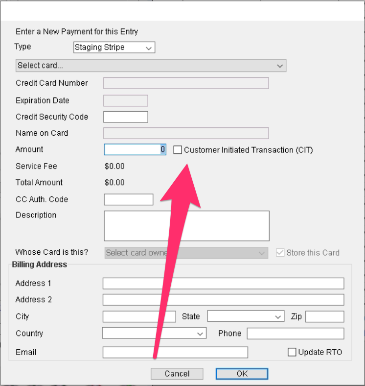

# CIT/MIT Transactions

## What are CiT and MiT Transactions?

A CiT transaction is defined as a Customer Initiated Transaction. This means that the transaction was in fact initiated by the customer. Examples of these types of payments are when exhibitors check out for their entry in their SGL account.&#x20;

A MiT transaction is defined as a Merchant Initiated Transaction. These transactions are card payments that are made by the merchant without the customer being actively involved. These are made as part of an agreement that is made with an initial Customer Initiated Transaction.&#x20;

## Distinguishing Payment Type

Since the industry is starting to distinguish between these types of payments, MiT payments cannot be ran on cards that do not have a previous CiT payment with that particular merchant on file.&#x20;

## What This Means for Office Staff

So far, this has only been an issue with one payment gateway, but this will most likely be seen across multiple payment gateways. Any card that does not have a previous Customer Initiated Transaction on file with that merchant will not be able to be run as a Merchant Initiated Transaction.

We have implemented a check system for these payments.&#x20;

When running a payment on an entry, we have added a checkbox for office staff to designate a card payment as a Customer Initiated Transaction if there is no previous record of a Customer Initiated Transaction with that card through the show company.&#x20;

The checkbox to distinguish a payment as a Customer Initiated Transaction is found in the payment box next to the Amount that is being paid.&#x20;

&#x20;

<figure><figcaption></figcaption></figure>

Once the user has selected a card, if there is not a CIT on record for that card, the system will notify the user to select this checkbox to run the payment as a CIT.

<figure><figcaption></figcaption></figure>

**\*\*It is important to remember that in utilizing this checkbox, that it is the show office's responsibility to ensure that the customer is in fact aware that that transaction will be run and is essentially requesting the office initiate the payment on their behalf.**&#x20;

